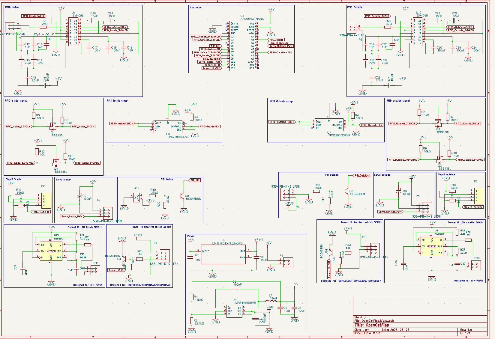
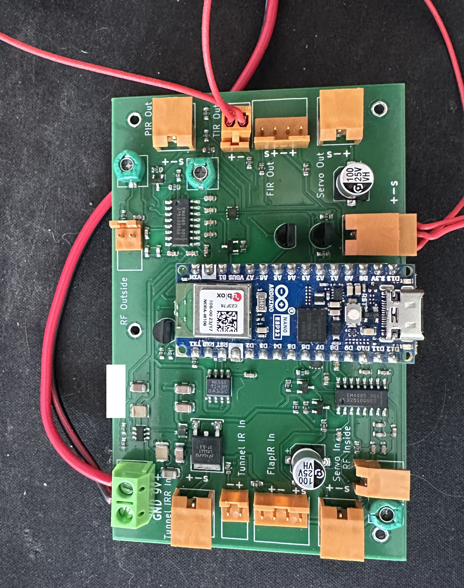

OpenCatFlap
=====

Work in progress...

Being fed up with SurePets cat flap requiring cloud connection to properly work, I decided to design my own flap.
The 3D model is intended to fit into the SurePet adapter already installed.

I want my flap to have at least these features:
1. Easily managable via an API and/or WebUI/MQTT
2. Powered by battery OR power plug!
3. Easy install via AP/Wifi
4. Motion detection on both sides of the flap to check on where a cat is and where it moves to
5. Light barrier that detects into which direction the flap got opened
6. Light barrier in both sides of the "tunnel" to check into which direction the cat moved
7. Independent control of mechanic in and out control. (My cats outsmart SureFlap by letting each other out/in)
8. Two RFID sensors to detect cats on each side and possibly both!
9. Modular design to easily remove the cover, the electronics and the mechanical parts without having to unscrew screws from the outside.

In addition to that the software should be capable of everything SureFlap is capable of, plus:
1. Set pets as "outdoor only"
2. Quickly and more easily set specific per-cat permissions
3. Manually "unlock once" option for each direction

Current state:
------
**Hardware:**

It is bases on an ESP32 (Arduino Nano ESP32 for development) with various sensors and two servos to lock/unlock.
The 3D model is ready to be tested and a printed version is already in use to debug the code. Slight adjustments to the
antenna design will be done in future.

Used vital parts:
- 2x PIR (motion detection): Panasonic AMN33111, testing with cheaper options
- 2x light barrier for flap detection: TCST 1103
- 2x light barrier for tunnel passage: IR LED + NE555 and TSOP18*38 and TSOP18*56
- 2x RFID reader: EM4095
- 2x Servo: DSM44

**Software:**

The software runs a main process that handles global configs and aggregates events reported by the two state machines.
After the last hardware overhaul, quite some work is to be done to update sensors and reading RFID from EM4095 instead of WL-134

## State machines
The locking and unlocking logic is split up into two independent state machines, one for each direction of travel.
One state machine handles the PIR, RFID and Servo on one side of the cat flap.

This way the flap can idependently unlock for ougoing or incoing cats without acidentally opening the other direction aswell, allowing false passages.

Roughly speaking there are 3 states: Idle (only PIR active to wait for motion), Reading (RFID enabled when motion is detected) and unlocked (when a correct RFID is read).

## Wifi

If no Wifi is configured, the flap acts as an AP opening an open "OpenCatFlap" wifi. One can either use this wifi for full control via api, or send credentials to connect to an existing wifi.

## MQTT

MQTT can be configured to connect to an existing MQTT server. The flap will then send events to topics `opencatflap/<flapname>/<type>`.
Configuration via MQTT is planned.

## Webserver

Current means to configure the flap is via http. There is a webserver running on :80 that takes requests to configure wifi, mqtt, lock allowance and cats, aswell as getting some status information.


How to configure (for now):
Wifi: `curl -H "Content-Type: application/json" http://192.168.4.1/api -d '{"command": "wifiConfig", "ssid": "Bockenburg", "passphrase": "", "ntpServer": "ip preffered, hostname possible"}'`
MQTT: `curl -H "Content-Type: application/json" 'http://10.5.0.60/api' -d'{"command": "mqttConfig", "server": "mosquitto.ahome", "port": 8011, "ssl": true, "logActivity": true}'`
MQTT Certificates: 
```
curl -H "Content-Type: text/plain" 'http://10.5.0.60/api/certs?name=key' --data-binary @/home/alex/trash/opencatflap.key
curl -H "Content-Type: text/plain" 'http://10.5.0.60/api/certs?name=cert' --data-binary @/home/alex/trash/opencatflap.crt
curl -H "Content-Type: text/plain" 'http://10.5.0.60/api/certs?name=ca' --data-binary @/home/alex/trash/ca.crt
```

**Future Improvements:**
- NE555 is too inconsistant due to 5% tolerance capacitor with bad temperature coefficient
- Tuning condensators for EM4095 have to be bigger to allow more jiggle-room when building an antenna
- Cheaper connectors for the PCB and external sensors
- Battery backup circuit
- ESP32 directly onboard





