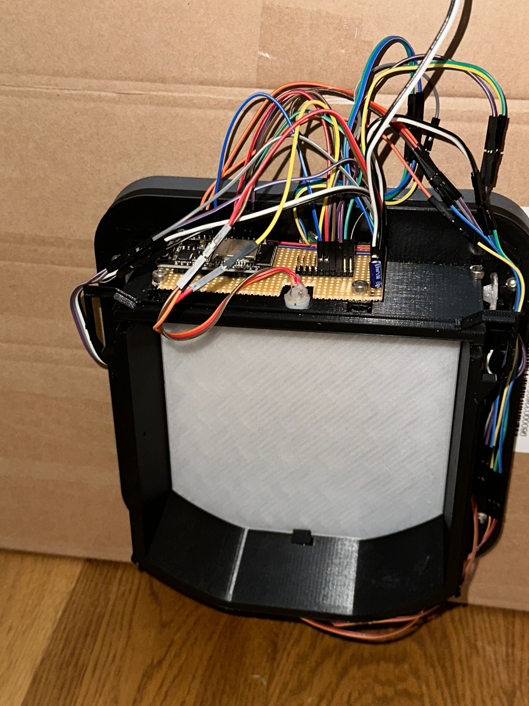
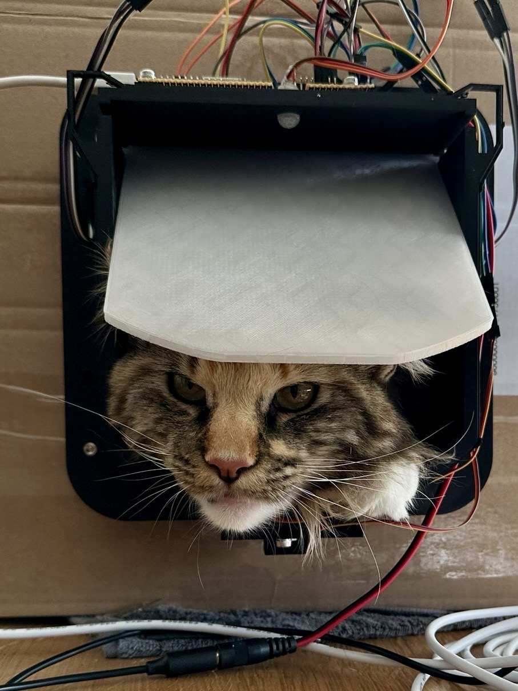

OpenCatFlap
=====

Work in progress...

Being fed up with SurePets cat flap requiring cloud connection to properly work, I decided to design my own flap.
The 3D model is intended to fit into the SurePet adapter already installed.

I want my flap to have at least these features:
1. Easily managable via an API and/or WebUI/MQTT
2. Powered by battery OR power plug!
3. Easy install via AP/Wifi
4. Motion detection on both sides of the flap to check on where a cat is and where it moves to
5. Light barrier that detects into which direction the flap got opened
6. Light barrier in both sides of the "tunnel" to check into which direction the cat moved
7. Independent control of mechanic in and out control. (My cats outsmart SureFlap by letting each other out/in)
8. Two RFID sensors to detect cats on each side and possibly both!
9. Modular design to easily remove the cover, the electronics and the mechanical parts without having to unscrew screws from the outside.

In addition to that the software should be capable of everything SureFlap is capable of, plus:
1. Set pets as "outdoor only"
2. Quickly and more easily set specific per-cat permissions
3. Manually "unlock once" option for each direction

Current state:
------
**Hardware:**

Pretty much decided on the Hardware for now. It will base on an ESP32 with various sensors and two servos to lock/unlock.

The 3D model is ready to be tested and a printed version is already in use to debug the code.

**Software:**

Just started working on this... As RFID is still missing, no cat detection is yet ready. It works as a dumb cat flap though.

